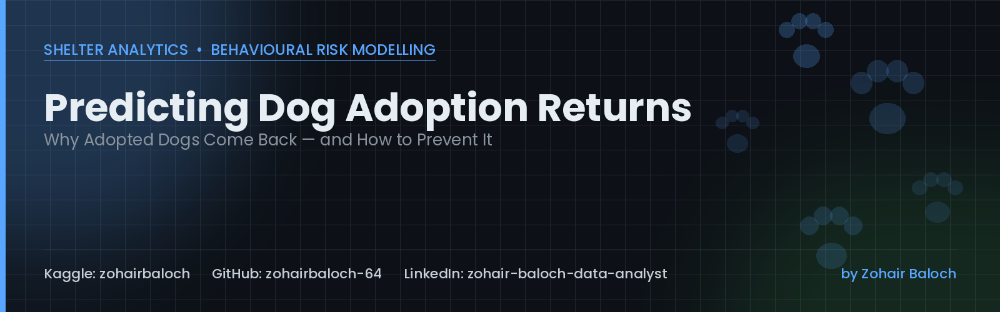

# 🐾 Predicting Dog Adoption Returns
### A Behavioural Risk & Shelter Analytics Case Study

**Author:** Zohair Baloch
**Kaggle:** [zohairbaloch](https://www.kaggle.com/zohairbaloch) &nbsp;|&nbsp; **GitHub:** [zohairbaloch-64](https://github.com/zohairbaloch-64) &nbsp;|&nbsp; **LinkedIn:** [zohair-baloch-data-analyst](https://www.linkedin.com/in/zohair-baloch-data-analyst)

---

Roughly **1 in 6 shelter dogs** in this dataset is eventually returned. Every return is a dog re-entering the system, a shelter kennel occupied for longer, and a family experience that ended in disappointment. This project builds an end-to-end analytics pipeline — from raw intake and behavioural data to a validated, explainable risk model — to answer one question: **can we flag a risky match *before* it happens?**

## 📋 Project Overview

**Dataset:** 42,000 dog adoption records from a shelter network, spanning intake details, shelter behavioural assessments, adopter household profile, and the final outcome (kept vs. returned).

**Business context:** Shelters run behavioural assessments and pre-adoption counselling, but resources are limited. If we can score *risk of return* at the point of matching, staff can focus extra counselling, trial visits, and follow-up on the adoptions that need it most — instead of treating every match the same.

**What this project does:**
- Audits data quality and documents every judgment call made
- Explores the behavioural, household, and process factors linked to returns
- Benchmarks multiple classification models to predict `returned`
- Explains the winning model with SHAP so the "why" is as useful as the "who"
- Translates findings into concrete, shelter-level recommendations

## 🧭 Framework: PACE

This analysis follows the **PACE** framework end to end:

| Stage | Focus |
|---|---|
| **P**lan | Define the business task, stakeholders, and key questions |
| **A**nalyze | Clean the data, understand its structure, explore patterns |
| **C**onstruct | Engineer features and build/benchmark predictive models |
| **E**xecute | Interpret results and deliver actionable recommendations |

## 🎯 Plan

**Business task:** Predict whether an adopted dog will be returned to the shelter (`returned` = 1), using information available *at the time of adoption* — not information that only exists after the fact.

**Key questions:**
- Which behavioural traits (aggression, anxiety, reactivity) are most strongly linked to returns?
- Does the *match quality* between dog and household (energy mismatch, size vs. home type) matter as much as the dog's own behaviour?
- Do protective, process-driven steps — pre-adoption visits, meeting resident pets, counselling — actually reduce returns?
- Can a model built only from pre-adoption data reliably flag high-risk matches?

## 🗂️ Dataset

| File | Description |
|---|---|
| `data/dog_adoption_master.csv` | 42,000 rows × 32 columns — one row per adoption |
| `data/data_dictionary.csv` | Column-level definitions for every feature |

**Data quality notes:**
- No duplicate rows and no duplicate `adoption_id` values.
- `days_to_return` is missing for 35,703 rows — this matches the count of kept dogs exactly, so the missingness is structural (a dog never returned has no "days to return"), not an error.
- `return_reason` and `days_to_return` are both *outcomes of a return* — they don't exist until after a return happens, so they are excluded from all modeling to avoid data leakage.

## 📊 Exploratory Data Analysis

### Target Distribution

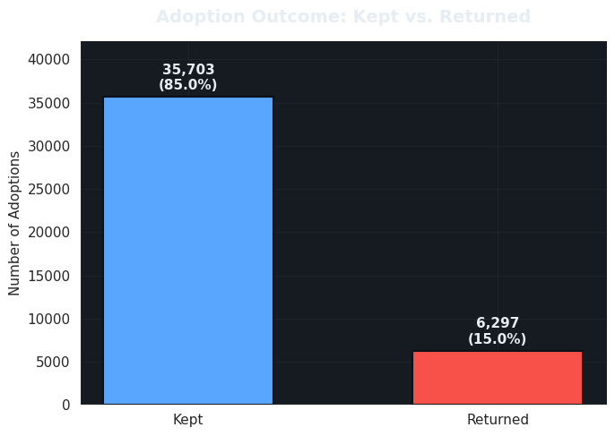

- **14.99%** of adoptions in this dataset end in a return — close to the commonly cited "1 in 6" shelter benchmark.
- The class imbalance (≈85% kept vs. ≈15% returned) means accuracy alone would be a misleading model metric — ROC-AUC, precision, and recall matter more here.

### Behavioural Assessment Scores by Outcome

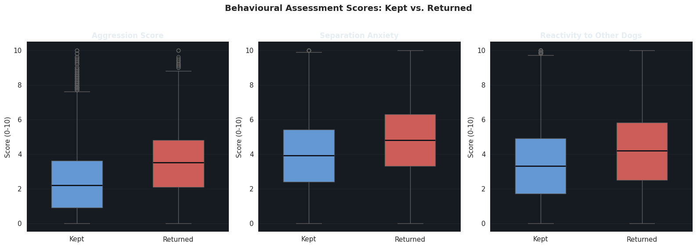

- **Aggression score shows the widest gap**: returned dogs average **3.52** vs. **2.35** for kept dogs (+1.17).
- Separation anxiety and reactivity to other dogs are both elevated in returned dogs, but by a smaller margin (+0.87 and +0.79 respectively).
- None of these gaps are enormous in isolation, suggesting behaviour alone won't fully separate the two groups — household match quality likely compounds the risk.

### Return Rate by Categorical Factors

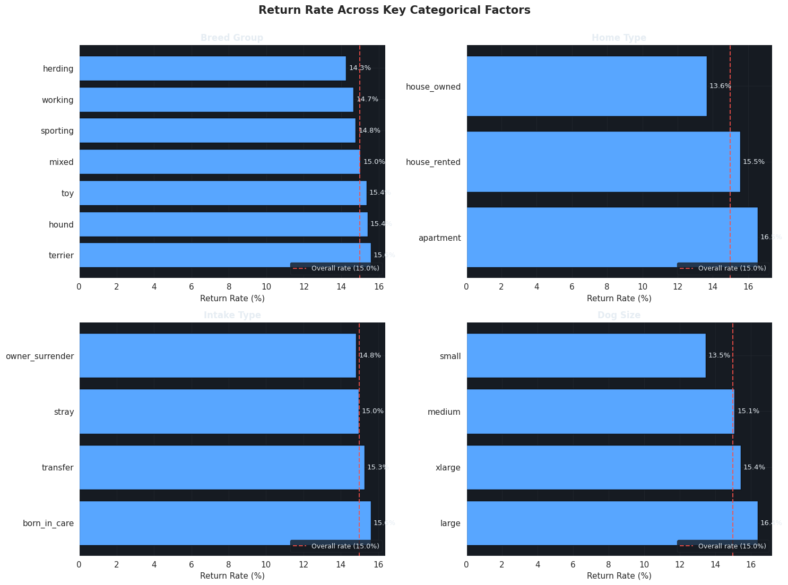

- **Home type matters more than breed or intake source**: apartments show the highest return rate (**16.5%**) vs. house-owned homes at the lowest (**13.6%**).
- **Breed group differences are small** (14.3%–15.6% range) — no single breed group stands out as dramatically riskier.
- **Intake type barely moves the needle** (14.8%–15.6%).
- Chronic medical needs push the return rate up to **17.7%** vs. ~14.8% for dogs with no medical needs.

### Correlation with Return Outcome

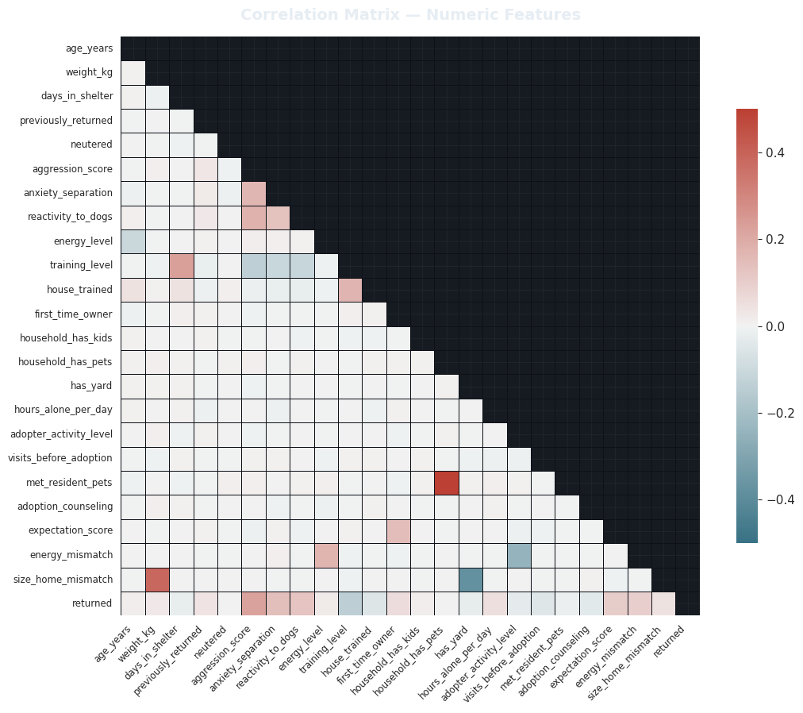

- **`aggression_score`** is the single strongest linear signal (**r ≈ 0.23**).
- **`anxiety_separation`** (r ≈ 0.14), **`reactivity_to_dogs`** (r ≈ 0.13), and **`expectation_score`** (r ≈ 0.10) round out the top predictors.
- **`training_level`** is the strongest *protective* signal (r ≈ -0.14).
- No feature is highly correlated on its own — a sign this is a multi-factor risk problem, not one dominated by a single variable.

### Why Are Dogs Actually Returned?

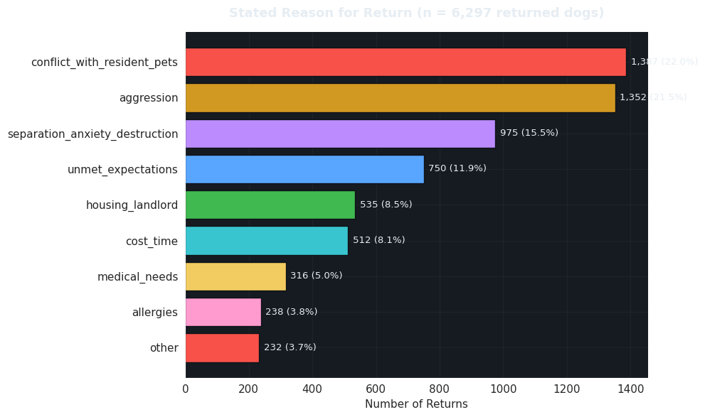

- The top two reasons — **conflict with resident pets** (22.0%) and **aggression** (21.5%) — together account for over **40%** of all returns.
- **Separation anxiety / destructive behaviour** (15.5%) is the third-largest reason.
- Circumstantial reasons — **housing/landlord** (8.5%) and **cost/time** (8.1%) — matter, but are a smaller share than behavioural mismatches.
- **Allergies** (3.8%) and **medical needs** (5.0%) are the least common reasons.

### Match Quality: Expectations & Energy Mismatch

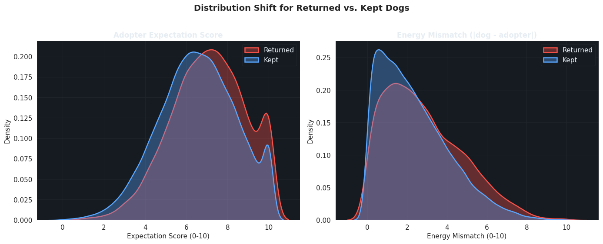

- Returned adoptions skew toward **higher expectation scores** (avg **7.07** vs. **6.53** for kept).
- **Energy mismatch is also higher for returns** (avg **2.82** vs. **2.35**).
- Neither shift is dramatic alone — these read as *contributing* factors rather than standalone predictors.

### Do Protective Steps Actually Help?

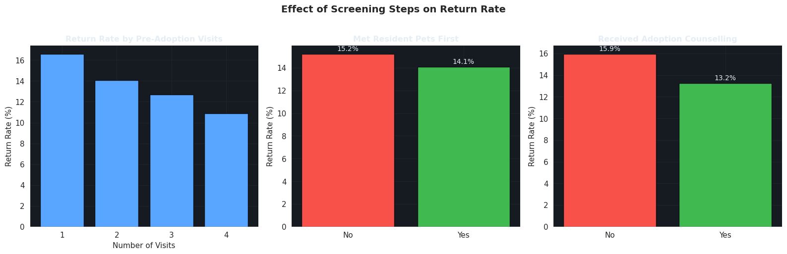

- Return rate **decreases as pre-adoption visits increase** — a clear, usable operational signal.
- Counselling and meeting resident pets first look "neutral" in raw comparisons — this reflects that shelters direct counselling toward *already higher-risk* cases (confounding), not that counselling fails. The model-based view below corrects for this.

## 🏗️ Construct — Modeling

**Features excluded to prevent leakage:** `return_reason`, `days_to_return` (both only exist after a return occurs), and `adoption_id` (identifier, no predictive value). Every remaining feature is known at the moment of adoption.

Five classifiers were benchmarked: Logistic Regression, Decision Tree, Random Forest, Gradient Boosting, and XGBoost.

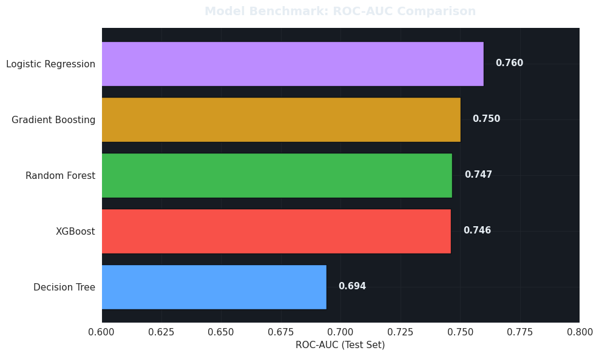

- **Logistic Regression narrowly achieves the best ROC-AUC (≈0.76)**, edging out the tree-based ensembles — reported honestly rather than defaulting to "the fanciest model wins."
- **Gradient Boosting reaches the highest accuracy (≈0.85)** but has the **weakest recall (≈0.10)** — a poor fit when missing a high-risk return is the costlier error.
- **XGBoost was carried forward for explainability**, since it offers a strong recall/precision balance and integrates cleanly with SHAP.

### Evaluating the Selected Model (XGBoost)

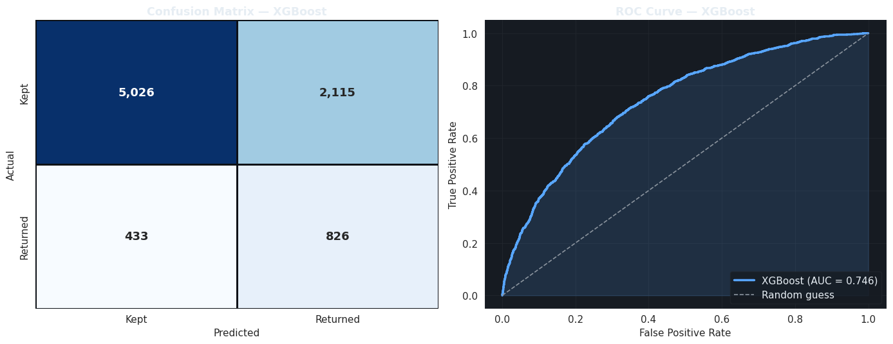

- The ROC curve sits well above the diagonal (**AUC ≈ 0.75**) — real, moderate discriminative power on a genuinely hard prediction problem.
- Because false negatives (a risky match predicted as safe) are the costlier error, the **decision threshold could be lowered below 0.5** in production to trade some precision for higher recall.

### Model Explainability with SHAP

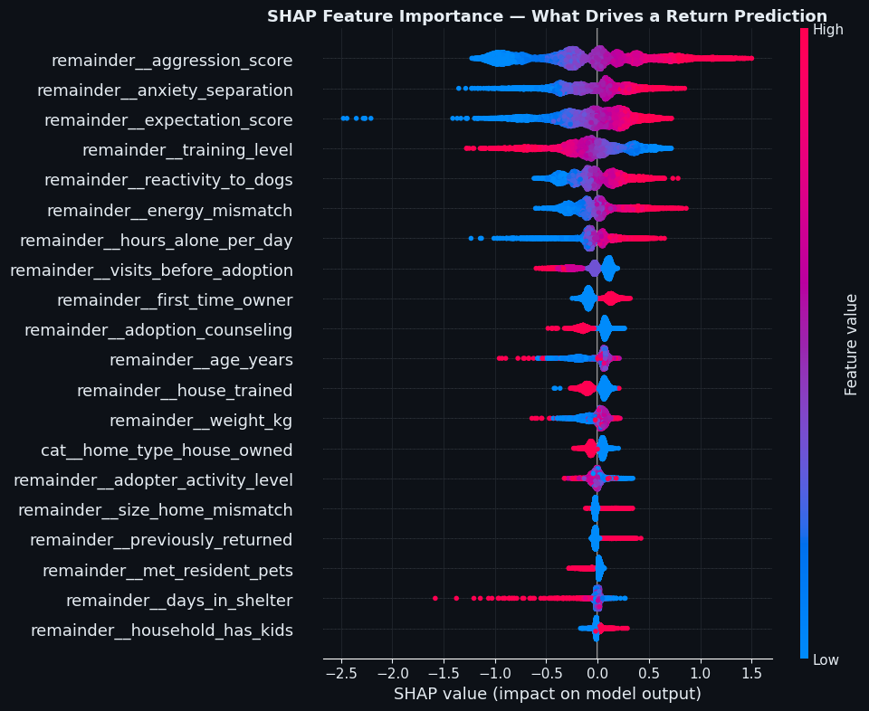

- **`aggression_score` is confirmed as the single most influential feature** in the model's predictions.
- **`training_level`** shows up as a strong protective feature.
- **`anxiety_separation`**, **`expectation_score`**, and **`energy_mismatch`** all contribute meaningfully — the EDA-stage hypotheses translate into real model-driving signal.
- Unlike the raw bivariate comparison, SHAP shows **`adoption_counseling`** and **`met_resident_pets`** do carry protective weight once other risk factors are held constant.

## ✅ Execute — Key Findings

- **Behaviour, not breed, drives returns.** Aggression score is the strongest single predictor by a wide margin; breed group differences are practically negligible.
- **Match quality compounds behavioural risk.** Energy mismatch and high adopter expectations independently raise return risk.
- **Conflict with resident pets and aggression together explain over 40% of all returns** — the two highest-leverage areas for intervention.
- **Training level is a strong protective factor** — pre-adoption obedience work appears to pay off in adoption durability.
- **Raw comparisons can mislead.** Counselling and pre-meet-the-pets steps looked "ineffective" in simple averages, but that's a confounding artefact corrected by the SHAP-based view.
- **A pre-adoption-only model reaches ROC-AUC ≈ 0.76** — solidly better than random, useful for triage, but not a substitute for human judgement.

## 💡 Recommendations for Shelter Operations

- Prioritize extra counselling and trial visits for adoptions flagged high-risk by the model.
- Weight aggression and reactivity scores more heavily in the matching process, especially for households with resident pets.
- Screen for energy mismatch explicitly — flag matches where the gap between dog energy and adopter activity level is large.
- Set expectations deliberately during counselling, since high `expectation_score` correlates with returns.
- Continue and expand pre-adoption training programs.
- Use the model as a triage tool, not a gatekeeper — a moderate AUC means it should support staff judgement, not replace it.

## ⚠️ Model Limitations

- ROC-AUC of ≈0.76 is moderate, not excellent — a meaningful share of returns remain unpredictable from pre-adoption data alone.
- The dataset reflects one shelter network's process and scoring methodology — results may not transfer directly elsewhere.
- Class imbalance (≈15% returned) means precision and recall must be balanced deliberately via threshold tuning for real deployment.
- Correlational, not causal — SHAP explains what the model uses to predict, not proven causal mechanisms.

## 🛠️ Tech Stack

`Python` · `Pandas` · `NumPy` · `Matplotlib` · `Seaborn` · `Scikit-learn` · `XGBoost` · `SHAP`

## 📁 Repository Structure

```
├── dog_adoption_returns_analysis.ipynb   # Full analysis notebook
├── data/
│   ├── dog_adoption_master.csv
│   └── data_dictionary.csv
├── images/                               # All chart exports + cover banner
└── README.md
```

## 📌 Conclusion

This analysis shows that **dog adoption returns are predictable, to a meaningful degree, from information already collected at the point of adoption** — behavioural assessment scores, household context, and match-quality indicators. The strongest lever available to shelters isn't breed selection or intake source; it's **behavioural screening combined with deliberate expectation-setting and training support**, focused on the households and dogs the model flags as higher risk.

---

Thanks for reading — feedback and Stars are always welcome.

**Zohair Baloch**
Kaggle: [zohairbaloch](https://www.kaggle.com/zohairbaloch) &nbsp;|&nbsp; GitHub: [zohairbaloch-64](https://github.com/zohairbaloch-64) &nbsp;|&nbsp; LinkedIn: [zohair-baloch-data-analyst](https://www.linkedin.com/in/zohair-baloch-data-analyst)
